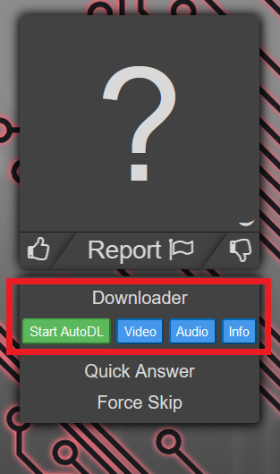

# AMQ-Toolbox 指南

這篇指南會告訴你如何利用此 library 建立一個 plugin。

## Library 簡介
此專案目前包含了兩個 library：
### amq-toolbox
- 提供簡易的方式註冊一個 plugin 到此框架
- 包裝數個 AMQ 網站的元件（Component）及容器（Container），你可以快速建立它們而不用擔心底層實作
- 當然，你也可以自己建立元件，並加入到 amq-toolbox 提供的容器 

### anime-list
- 共同的 API 以便操作諸如 Kitsu、Anilist、MyAnimeList 等網站的動畫列表
- 操作這些動畫列表需要使用者授權，為此 anime-list 也提供了簡易的登入、登出 API（OAuth）

## 建立並註冊一個 Plugin
要建立一個新的 Plugin，你必須實作 `IPlugin` 這個介面（Interface）

包含了以下幾個屬性（Attribute）
- `name`：plugin 名稱（須唯一）
- `dependencies`（optional）：依賴的 plugin 名稱列表，在此列表的 plugins 會早於此 plugin 載入
- `view`（optional）：實作 `IComponent` 介面的元件，會在 Guess 時顯示在右側



- `options`（optional）：實作 `IOptions` 介面的元件，放置在 Toolbox 設定 modal 的 option 頁籤


- `settingTab`（optional）：實作 `ITab` 介面的元件，會在 Toolbox 設定 modal 建立一個獨立的的頁籤


與以下幾個方法（Method）
- `enable`：啟用此 plugin 時呼叫
- `disable`：停用此 plugin 時呼叫
- `enabled`：此 plugin 是否啟用

以下為一個簡易的範例

```typescript
import { 
    IPlugin,
    onStartPageLoaded,
    registerPlugin,
} from 'amq-toolbox';

class ExamplePlugin implements IPlugin {
    readonly name = 'Example';
    private _enabled = false;
    
    constructor () {
    }

    enable(): void {
      this._enabled = true;
    }

    disable(): void {
      this._enabled = false;
    }

    enabled(): boolean {
      return this._enabled;
    }
}

function main() {
    onStartPageLoaded(() => {
        registerPlugin(new ExamplePlugin());
    });
}

$(main);
```

這個範例會註冊一個無功能的 Plugin "Example" 到 AMQ-Toolbox

請注意，建議使用 `onStartPageLoaded()` 並在 callback 使用 `registerPlugin()` 確保 plugin 能正確地被載入

## amq-toolbox 元件
在建立 plugin 的過程中，你可能需要實作（Implement）諸如 `IOptions`、`ITab` 等介面（Interface）。amq-toolbox 提供了一些類別（Class），你可以使用它們快速建立符合介面的元件（Component）

關於這些介面及類別的定義，請參考 [amq-toolbox 文件](./amq-toolbox_zh.md)
